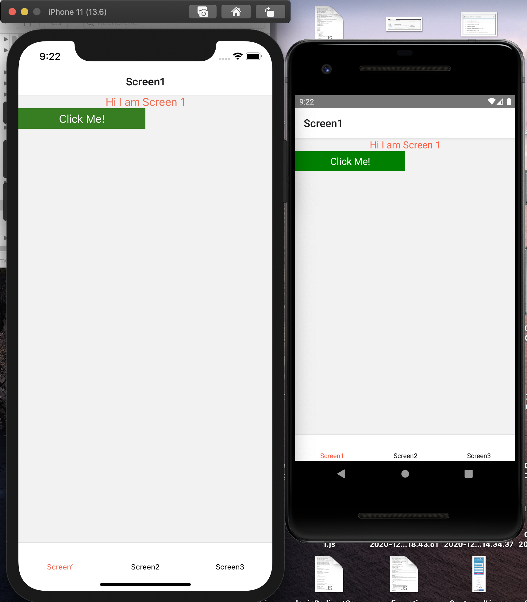
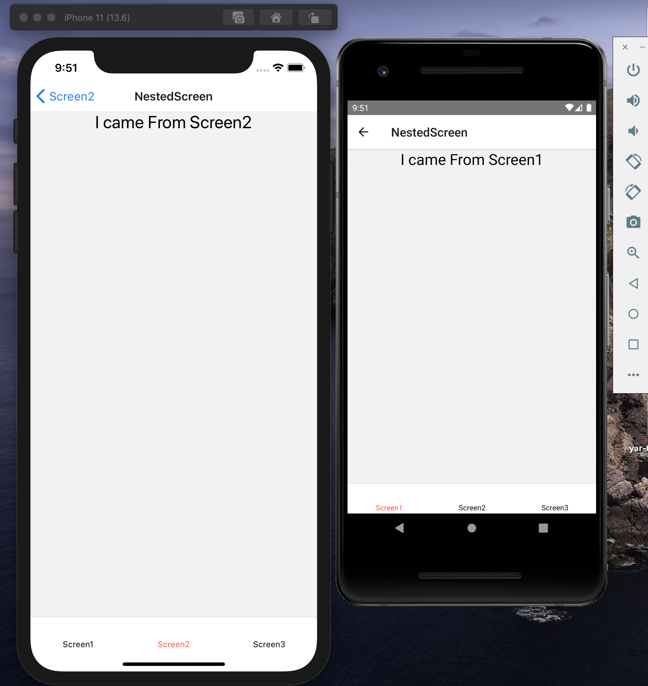

# React-Native-Shopping-App
A simple Shopping App in React Native. For Complete Functionality... check https://www.youtube.com/watch?v=Lf0MLrcSx0Q
# Close the app and run "npm install" in root folder

# Combine Bottom Tab Navigator with Stack Navigator in React Navigation 5
Since React Navigation 5 is released, all of the configurations happens inside a component and are dynamic. This has led to significant changes in the way we used to assign navigation within our app. Implementing Stack Navigator within the Tab Navigator felt like a hurdle in the new React Navigation 5. After a lot of research and going through their docs I finally managed to get it working. I am going to walk you through the implementation in the simplest was such that it won't act as a roadblock for you anymore. So follow along with me and let's get started.

# Screen Shots

